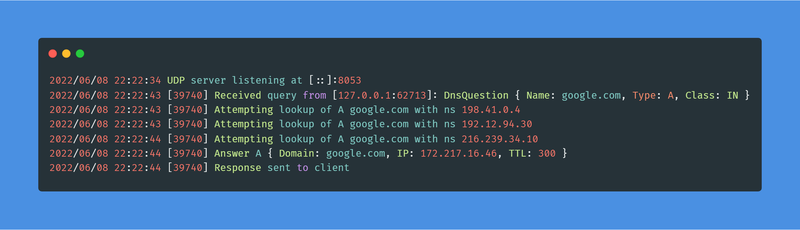

# DNS server in Go
Simple (yet fully functional) DNS server implementation that I've written for fun and better understanding of the DNS protocol.

The project was inspired by [Emil Hernvell's](https://github.com/EmilHernvall) [dns-guide](https://github.com/EmilHernvall/dnsguide),
however I chose to implement it in Go instead of Rust and added few more features.



## Features
- DNS packets serialization and deserialization
- recursive names resolving with the [Internet root servers](https://www.internic.net/domain/named.root)
- configuration via environment variables
- UDP server for handling queries with concurrency
- Support for the following records:
    - A
    - AAAA
    - CNAME
    - MX
    - NS
    - SOA

## Usage
Copy `.env.template` to `.env` and change the values for your liking or provide them via OS's env vars.

#### Run
```bash
> go run main.go
```

#### Watch mode (for development)

If you have Node.JS and [nodemon](https://www.npmjs.com/package/nodemon) installed on your machine, you can simply run
the command below and the server will restart every time you make any changes to the source code.

```bash
> nodemon
```

## @TODO
- add HTTP/REST server
- support TCP
- support [EDNS](https://datatracker.ietf.org/doc/html/rfc6891)
- support DNSSEC
- support authoritative server mode
- support forwarding mode (using another DNS server instead of root servers)
- support for more record types
- CLI mode for serializing/deserializing raw packets from disk
- CLI mode for one-time name resolve
- records caching
- write tests
- compress labels when serializing packets
- Dockerize